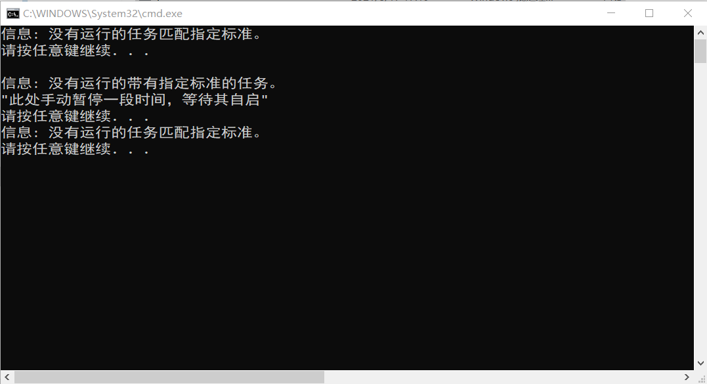

## 卸载主体

推荐使用geek uninstaller进行卸载。

## 清除文件

在everything中搜索 easyconnect, Sangfor。确认是这软件的东西后丢火绒文件粉碎里。

## 查看后台进程

运行仓库中的1.bat文件。将检索后台中 Sangfor开头的所有进程，并执行taskkill杀掉。当看到提示"此处手动暂停一段时间，等待其自启"时，等待几秒后按键，再次检索Sangfor开头进程。若显示为下图时应该算基本卸载干净了。



## 特殊情况处理

若清理后出现电脑运行不了的情况，尝试在管理员权限下执行

```batch
netsh winsock reset
```